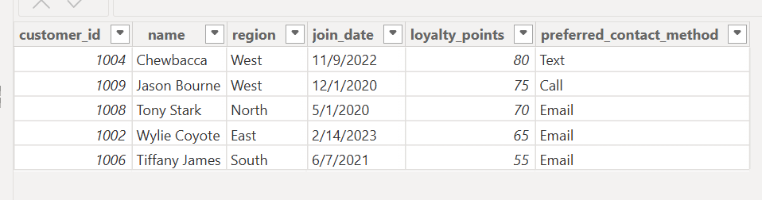
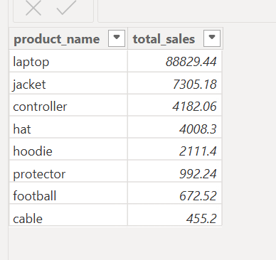
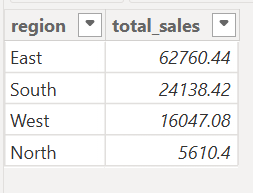
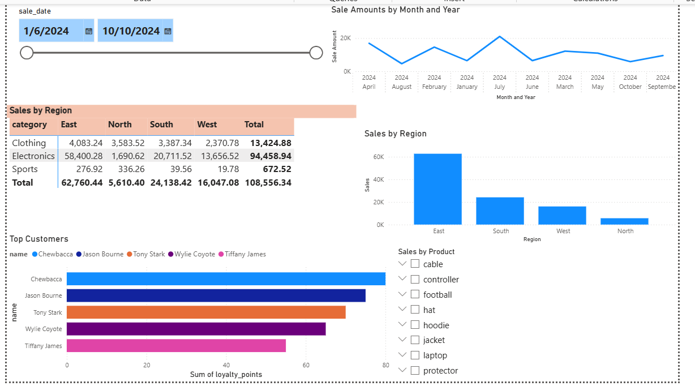

# smart-store-caffery
A project designed for inventory management. The goal is to use Git for version control and document our workflow.

## Table of Contents
- [smart-store-caffery](#smart-store-caffery)
  - [Table of Contents](#table-of-contents)
  - [Project Setup](#project-setup)
  - [Git Workflow](#git-workflow)
  - [Key Files](#key-files)
  - [Using a Virtual Environment](#using-a-virtual-environment)
  - [Running Python Scripts](#running-python-scripts)
  - [Updating and Pushing Changes](#updating-and-pushing-changes)
  - [Final Notes](#final-notes)
  - [P3 - Data Cleaning \& Prepare for ETL](#p3---data-cleaning--prepare-for-etl)
  - [P4 - Create and Populate a DW](#p4---create-and-populate-a-dw)
  - [P5 - Cross-Platform Reporting with Power BI \& Spark](#p5---cross-platform-reporting-with-power-bi--spark)
    - [SQL Queries and Reports](#sql-queries-and-reports)
    - [Reports](#reports)
    - [Design](#design)
    - [Power BI Model View](#power-bi-model-view)
    - [Query Results](#query-results)
    - [Charts](#charts)
  - [P6: BI Insights and Storytelling](#p6-bi-insights-and-storytelling)
    - [Business Goal](#business-goal)
    - [Data Source](#data-source)
    - [Tools](#tools)
    - [Workflow \& Logic](#workflow--logic)
    - [Results](#results)
    - [Challenges](#challenges)

## Project Setup
1. Clone the Repository
To get started, clone the repository from GitHub:

git clone https://github.com/ellacaffery/smart-store-caffery.git

Navigate into the project folder:
cd smart-store-caffery

1. Open Project in VS Code
    Open VS Code.
    Use File > Open Folder and select the project folder.
    Verify that key files such as README.md, .gitignore, and requirements.txt are present.

## Git Workflow
1. Checking the Current Branch
Before making changes, check your current branch:
git branch
Ensure you are on the main branch.

2. Pulling the Latest Changes
Always fetch the latest changes before making updates:
git pull origin main --rebase

3. Making Changes and Saving Files
Edit files as needed and save your work in VS Code (Ctrl + S or Cmd + S).

4. Staging and Committing Changes
After editing, add your changes to Git:
git add .
git commit -m "Descriptive commit message"

5. Pushing Changes to GitHub
Once committed, push updates to GitHub:
git push origin main

## Key Files
- README.md → Project documentation and workflow tracking.
- .gitignore → Specifies files to exclude from version control.
- requirements.txt → Lists Python packages required for the project.
- utils/logger.py → Contains logging utilities (to be added).
- scripts/data_prep.py → Data preparation script (to be added).

## Using a Virtual Environment
A virtual environment isolates dependencies for the project.

1. Create the Virtual Environment
python -m venv .venv

2. Activate the Virtual Environment
Windows (PowerShell)
.venv\Scripts\Activate

1. Install Dependencies
pip install -r requirements.txt

## Running Python Scripts
To execute the data_prep.py script:
py scripts\data_prep.py

## Updating and Pushing Changes
After making updates to your project or README file, follow these steps:

git add .
git commit -m "Update README with workflow and commands"
git push origin main

## Final Notes
- Always pull (git pull origin main --rebase) before pushing changes to avoid conflicts.
- Use descriptive commit messages to track progress.
- If you get merge conflicts, resolve them manually and commit again.

## P3 - Data Cleaning & Prepare for ETL

Objectives
- Employ Python pandas to perform some common cleaning and prep tasks. 
- Wrap this functionality into a reusable DataScrubber class. 
- Use Python unittest (from the Python Standard Library) to verify our DataScrubber class methods have been correctly defined and perform the necessary work correctly. 
- Finish the TODO items in the provided DataScrubber class. 
- Run the test data scrubber script to verify ALL tests pass 100%. 
- Use the DataScrubber class in your data prep script. 

Data Cleaning Process (using Python pandas)
1. Initial Data Inspection and Profiling
df.info(): Check data types and identify missing values.
df.describe(): Get summary statistics for numerical columns.
df.head() and df.sample(): Inspect the structure and sample of the data.
2. Handle Missing Data
Identify missing values: df.isnull().sum()
Drop missing values: df.dropna()
Fill missing values: df.fillna(value)
3. Remove Duplicates
Identify duplicates: df.duplicated()
Drop duplicates: df.drop_duplicates()
4. Filter or Handle Outliers
Identify outliers: df.describe() and box plot visualization.
Filter outliers: df[df['column'] < upper_bound]
5. Data Type Conversion and Standardization
Convert data types: df.astype()
Parse dates: pd.to_datetime(df['column'])
6. Standardize and Format Data
Apply string formatting: df['column'].str.lower() and df['column'].str.strip()
Rename columns: df.rename(columns={'old_name': 'new_name'})
7. Column Management
Drop unnecessary columns: df.drop(columns=['column'])
Reorder columns: df = df[['col1', 'col2', ...]]
8. Data Integration and Aggregation
Merge data: pd.merge(df1, df2, on='key_column')
Aggregate data: df.groupby().agg()

ETL Preperation
- Verify attribute names are clear with units for numerical traits.
- Attribute names have been standardized where possible.
- Verify all rows have the correct number of entries.
- Verify all duplication has been removed.
- Verify all bad, missing, or out of range records have been removed.
- Verify each column adheres to the expected data type (e.g., dates are in date/time formats, identifiers like phone numbers are consistent).
- Verify that collection and usage comply with relevant laws and regulations.

## P4 - Create and Populate a DW

Objectives:
- Understand the role of a data warehouse in business intelligence.
- Design a schema that effectively organizes data for analysis.
- Implement the schema using a database system to create a functional data warehouse.
- Write and execute an ETL script to populate the warehouse.
- Verify and document the schema and data.

Succesfully designed a star schema and loaded data sets from "customers_data_prepared", "products_data_prepared", and "sales_data_preprared" into a data warehouse names "smart_sales.db"

## P5 - Cross-Platform Reporting with Power BI & Spark

Objectives:
- Connect to an SQLite database for analysis
- Write and execute SQL queries for reporting
- Implement slicing, dicing, and drilldowns
- Create interactive visualizations
- Explore scalability & cloud-based solutions

### SQL Queries and Reports
1. Top Customers:
let
    Source = Odbc.DataSource("dsn=SmartSalesDSN", [HierarchicalNavigation=true]),
    customer_Table = Source{[Name="customer",Kind="Table"]}[Data],
    
    // Sort customers by 'loyalty_points' (or other column) in descending order
    SortedCustomers = Table.Sort(customer_Table, {{"loyalty_points", Order.Descending}}),
    
    // Get top 5 customers
    TopCustomers = Table.FirstN(SortedCustomers, 5)
in
    TopCustomers
  
2. Total Sales by Product:
let
    // Reference existing queries
    Products = product,
    Sales = sale,

    // Merge sales with products to get product names
    MergedTables = Table.NestedJoin(Sales, {"product_id"}, Products, {"product_id"}, "ProductDetails", JoinKind.Inner),

    // Expand product_name from the joined table
    Expanded = Table.ExpandTableColumn(MergedTables, "ProductDetails", {"product_name"}),

    // Group by product_name and sum sale_amount
    Grouped = Table.Group(Expanded, {"product_name"}, {{"total_sales", each List.Sum([sale_amount]), type number}}),

    // Optional: Sort descending by total_sales
    Sorted = Table.Sort(Grouped, {{"total_sales", Order.Descending}})
in
    Sorted

3. Sales by Region:
let
    // Reference existing customer and sales queries
    Customers = customer,
    Sales = sale,

    // Merge sales with customers to get region
    Merged = Table.NestedJoin(Sales, {"customer_id"}, Customers, {"customer_id"}, "CustomerDetails", JoinKind.Inner),

    // Expand the 'region' column from customer data
    Expanded = Table.ExpandTableColumn(Merged, "CustomerDetails", {"region"}),

    // Group by region and calculate total sales
    Grouped = Table.Group(Expanded, {"region"}, {{"total_sales", each List.Sum([sale_amount]), type number}}),

    // Optional: Sort by total_sales descending
    Sorted = Table.Sort(Grouped, {{"total_sales", Order.Descending}})
in
    Sorted

### Reports
  These queries are used to 
  1. Identify the top customers through their loyalty points
  2. Identify how many sales are generated from each product
  3. Identify how many sales happen in each region

### Design
I aimed to design my visuals in an easy to read manner that makes sense for the datasets.

### Power BI Model View

### Query Results

### Charts

## P6: BI Insights and Storytelling

Objectives:
- Analyze data using OLAP, slicing, dicing, and drilldown techniques to identify business insights.
- Design a clear business question and define the data and metrics required to address it.
- Use Python (or an alternate tool) to implement OLAP-style queries and analysis.
- Present insights using clear visualizations and explain the business implications.
- Describe the logic, process, and challenges behind your OLAP implementation.

### Business Goal
Find total sales by day and identify the top products by day

### Data Source
I used smart_sales.db that I created in an earlier project. Then in my script olap_cubing.py, I used columbs from my customer and sale tables. I used "sale_date" to generate a DayofWeek column, product_id, customer_id, sale_amount_sum, sale_id_count, sale_id.

### Tools
I used Python and SQLite to execute my scripts. Then my visuals were created through Seaborn and Matplotlib.

### Workflow & Logic
I used the example provided in GitHub to format my scripts. I went through and made sure my column names were correct. Once all column names were correct, the script ran correctly and generated my visuals. The only thing I wish I would've done differently is have my graphic display the product name rather than ID. 

### Results

List of Product ID's:
- 101: Laptop
- 102: Hoodie
- 103: Cable
- 104: Hat
- 105: Football
- 106: Controller
- 107: Jacket
- 108: Protector
Laptop dominates sales on everyday. 

Sales are much higher on Monday, Wednesday, and Thursday from the rest of the week. Might look into special deals or promotions on days such as Sunday, Tuesday, Friday, and Saturday to increase sales. 

### Challenges
This project ran pretty smoothly actually. Just a few fixes throughout my scripts. 
